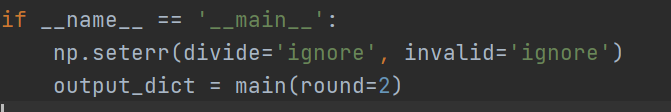
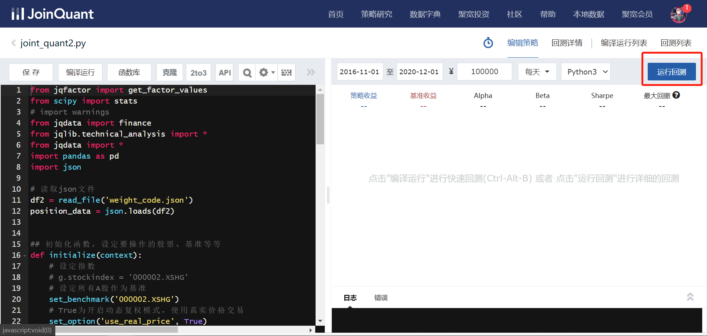

## Data Preparation

### 1.   Text Data Preparation

The source code ‘./bert_classification/modeling.py’, ‘./bert_classification/multi_focal_loss.py’, ‘./bert_classification/optimization.py’, ‘./bert_classification/tokenization .py’ are extracted from google open source bert code (https://github.com/google-research/bert). And I modify some parts of these code, for example, add a Softmax layer with multi-focal loss.

 

Firstly, download the pretrained BERT model from https://drive.google.com/file/d/1yS3FCA-SEHsQxxslcqajcTJtVB2Tovjy/view?usp=sharing and unzip the package you will get a folder ‘chinese_L-12_H-768_A-12’ containing several files. Then move this folder to ‘./bert_classification/data’ 

 

In ‘./bert_classification’ is our hand-labeled training set, named ‘train_data.xlsx’, about 3,500. We can use this to train our Bert Model: Firstly, move the folder ‘./bert_classification’ to GPU FARM, open ‘bert_classification’ directory and execute command ‘**sh train_bert_model.sh**’ in the console of Linux (because the Bert model requires a GPU with high memory, we use GPU FARM which is built on Linux system). 

 

To generate a test set, firstly download the raw text data from https://drive.google.com/file/d/1FBdfBT_KVrLOXcXei_w-2rMS1wcFY-Ey/view?usp=sharing and unzip the package, and you will get a folder ‘舆情数据’. Move this folder to ‘./project数据’.

Then run ‘**./text_data_preprocess.py**’. By specifying the variable ‘year_start = 2006’, ‘year_end=2016’, we can generate about 10 years’ training text data in folder ‘./project数据/舆情数据/text_data’. Then move this folder to remote folder ‘./bert_classification’, execute command ‘python testData_gen.py’, you can get labeled text stored in the remoter folder ‘./text_result.xlsx’. For the back test, just specify ‘year_start = 2016’, ‘year_end=2021’ .

Then download training and back test ‘./text_result.xlsx’ from remote folder, and place it in ‘./project数据/舆情数据’, rename them ‘text_result_ori.xlsx’ and ‘./test_result.xlsx’ respectively. 

### 1.   Factors Data Preparation

To generate factors data, firstly download the raw factors data from https://drive.google.com/file/d/1cWdH9wBhgUGwg5heterCO2gtkSSeuruH/view?usp=sharing, and unzip the package, and you will get a folder ‘原始数据’. Move this folder under ‘./project数据’. Then run ‘./data_preprocess.py’, and you can get training data ‘data_train_date.xlsx’ and back test data ‘data_backtest_date.xlsx under folder ‘./project数据/因子数据’. 

### 2.   Merge factors data with text data

To merge factors with text factor, run ‘./merge_factor_with_text.py’, then you can get the final training data ‘train_data.parquet.gzip’ and back test data ‘backtest_data.parquet.gzip’ under ‘./project数据/model_data’.

 

### 3.   Factors Selection

To select the factors, just run ‘./factor_selection.py’, and the result ‘factorFilter_result.xlsx’ will be saved under folder ‘./project数据/因子数据’.

## Model Training

Run ‘./non_time_factor_model.py’, you can train Random Forest, Xgboost, Pca+Svm, Neural Network classification model using data ‘train_data.parquet.gzip’ generated in above steps. And the trained model will be saved under ‘./project数据/model/’. In detail, if you want to train and save the a specific model, you can set the parameter ‘trainable=True’ like the below picture shows.

Similarly, run ‘. /time_factor_model.py’, you can train the ‘RNN’, ‘LSTM’, ‘CNN’, ‘CNN+LSTM+ATTENTION’ classification model.

## Optimization

Run ‘./Optimization.py’ setting the parameter ‘round=1’ (img1) in main function, you can get a json file ‘output_code.json’ showing which stocks to buy every month within back test period. Then upload ‘output_code.json’ together with ‘./joint_quant1.py’ to JointQuant (https://www.joinquant.com/). In detail, place joint_quant1.py under ‘策略研究->策略列表’ (img2) and place output_code.json under ‘策略研究->研究环境’ (img3). Then run ‘joint_quant1.py’ on joint quant (img4), the program will select top 10 stocks according to ROE every month, and saved in the file ‘stock_choosen_10.json’. Then download it and move it to root path ‘./’. 

 

Then, Run ‘./Optimization.py’ setting the parameter ‘round=2’ (img5) in main function, you can get a json file ‘weight_code.json’ showing the internal weights within stock portfolio. Similarly, upload ‘weight_code.json’ and ‘joint_quant2.py’ to JointQuant (img6, img7) and run ‘joint_quant12.py’ on joint quant (img8), the program will return the final yield curve. You can allocate different weight between stock and bond as img9 shows. By doing so, you can get different yield curve.

​                  *(img1)*

​          *(img2)*

​     *(img3)*

  *(img4)*

  *(img5)*

  *(img6)*

  *(img7)*

  

  *(img8)*

  

  *(img9)*

## User Interface

To see the user interface, just run ‘./front_end.py’, and the program will return a URL like this:

   Enter this URL in browser, you will see the webpage.

 

The web page is made up of 3 parts. You can switch to these 3 parts by clicking ‘HOME, SIGN IN, NEWS’ respectively. The ‘MENU’ part will be developed in the future after the project.

  

The first part is ‘Home Page’. You can switch to this page by clicking ‘HOME’. And you will see the yield curve and some parameters of our strategy. 

 

The second part is ‘Questionnaire’. You can switch to this page by clicking ‘SIGN IN’. And you will see a questionnaire to investigate investors’ risk appetite.

 

The third part is ‘NEWS’. You can switch to this page by clicking ‘NEWS’. You can choose the amount of news you want to see, by clicking ‘Confirm’ button, the program will extract latest financial news and shows their titles on the page like below:

  

 

If you are interested in one news. You can click it and the webpage will be redirected to a specific webpage which contains full content of this news.